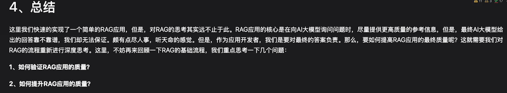
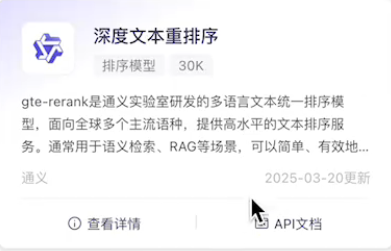

1.对于RAG这个具体方向，也可以使用LlamaIndex这个框架，它比Langchain更深
一个比较理想的学习路径是：
先用LangChain 快速上手一个最简单的RAG Demo，理解LLM应用的基本流程。
然后切换或并行学习LlamaIndex，用它做一个同样但更复杂的项目，会立刻感受到它在数据细节处理上的强大。

2.了解一下AI coding的使用

3.对某个已上线的AI产品的看法，对AI未来前景的看法

4.AutoGen:核心思想是多智能体对话：将复杂任务分解，由多个专门化的AI智能体通过对话协作完成 

5.了解大模型幻觉的全链路的优化思路：RAG 的整个链路，从文档解析、分块、嵌入、召回、重排、生成，每个环节都能优化幻觉

6.RAG 中的两类召回率：
(1).检索模块的召回率 【找得全不全】
这衡量的是检索器本身的性能。它评估的是：对于给定的问题，在检索器返回的 Top-k 个文档片段中，包含了多少个真正相关的文档片段。
关注点：检索器是否把所有相关的信息块都“捞”上来了。
计算公式：

检索召回率= 检索出的相关文档片段数/知识库中所有相关的文档片段总数
 
意义：这个指标直接反映了检索模块的“查全”能力。如果这个召回率很低，意味着很多关键信息根本没有被送到生成器面前，生成器就不可能给出正确答案。

(2).生成模块的精确率【找得对不对】
这衡量的是整个 RAG 系统的性能。它评估的是：在最终生成的答案中，包含了多少个问题所需的所有关键信息点。
关注点：最终答案是否“覆盖”了所有需要回答的要点。
计算公式（示例）：

精确率 = 检索到的相关文档数 / 检索到的总文档数
 

7.RAG的评估：
【评估框架：RAGAS】
在实际操作中，不需要自己实现这些复杂的计算逻辑。像 RAGAS (RAG Assessment) 这样的框架已经把这些方法都集成好了。它提供了一个完整的评估体系：
指标驱动：支持上述提到的忠实度、答案相关性、上下文精度/召回率等多种指标。
自动化测试集生成：它可以根据你的文档，自动生成包含问题、答案和上下文的数据集，极大地缓解了人工标注的压力

8.了解一下logging库的基本使用，记录日志

9.如何提升RAG应用的质量：https://www.bilibili.com/video/BV1DU2DByEJc?p=16&vd_source=8270dac49dcebe01a55868cae7bc3c79  【位置： 5.3节思考总结】

主要思路分两部分：评估于验证即如何评估rag的质量，评估质量后如何提升rag的质量

评估阶段思路：
建立一堆测试集数据，包含问题和标准答案。
（1）相似度评估：通过检索出来的答案和标准答案进行相似度比较，初步判断检索效果，但存在这样一个问题：这个评估是整体性的，如果检索出来的文档中包含错误的片段，就会导致相似度很低，降低评估效果.
（2）对检索的召回率和精确率进行评估，这里可使用RAGAS框架进行评估

提升阶段：
1.数据处理阶段：在索引初期（及处理数据入库初期），可以利用大模型对每一个拆分的部分生成一个对应的问题一起向量化存储（也可以是多个问题对应同一段内容），这样用户提问的时候很大概率与问题相匹配，也能在一定程度上提升检索质量（总结下来就是用户问题和预设问题的匹配query to query）

2.检索阶段：用户问题过多的话要做用户问题拆分，或者用户问题的扩展、改写【可以让大模型来做，只要设置一定规则即可】。
对于检索出来的问题进行ReRank重排序：这里可以使用排序模型

